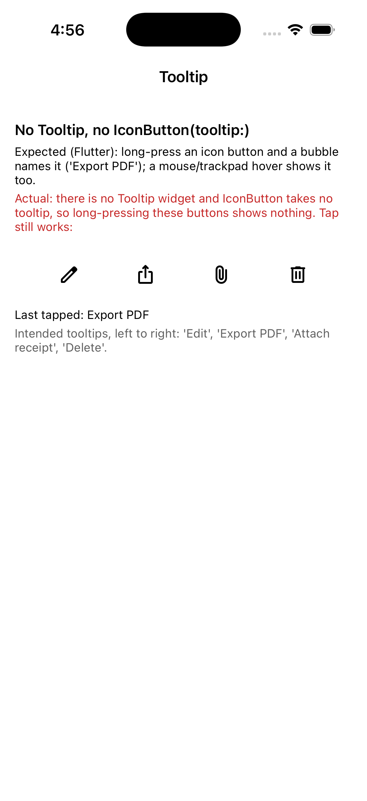

# Repro: no Tooltip and no IconButton(tooltip:)

Issue: https://github.com/DartNative/dartnative/issues/68

DartNative 1.0.0 has no `Tooltip` widget, and `IconButton` takes no `tooltip`. Icon-only toolbar buttons (edit, export, attach, delete) then have no way to tell the user what they do on long-press (or on hover with a pointer), and in Flutter the tooltip also serves as the button's accessibility label.

## Run

`dn run` (iOS simulator; Android behaves the same unless stated).

## What you'll see

Four icon-only `IconButton`s, with the intended tooltips listed under them.

1. Long-press the export button (second from the left) for 2 s: nothing appears, because there is nothing to attach a tooltip to.
2. Tap it: "Last tapped" reads "Export PDF", so the button itself works (the screenshot is after this step).

## Expected

As in Flutter: long-press an icon button and a small bubble shows its name ("Export PDF"); with a mouse/trackpad, hovering shows it.

## What we'd write in Flutter

```dart
IconButton(
  icon: const Icon(Icons.ios_share),
  tooltip: 'Export PDF',
  onPressed: exportPdf,
)

Tooltip(
  message: 'Hold to delete',
  child: HoldToDeleteButton(onDelete: delete),
)
```

`dn analyze` on 1.0.0:

```
error • The named parameter 'tooltip' isn't defined • undefined_named_parameter
error • The function 'Tooltip' isn't defined • undefined_function
```

## Recording



## Environment

- DartNative 1.0.0 (SDK `113c27aacb2`, framework edition `7ae29132`), Dart 3.12.0
- macOS 26.7.1, Xcode 26.1.1
- iPhone 17 simulator, iOS 26.1
